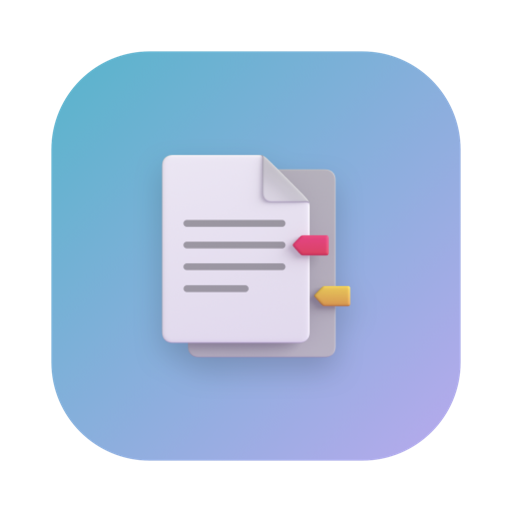
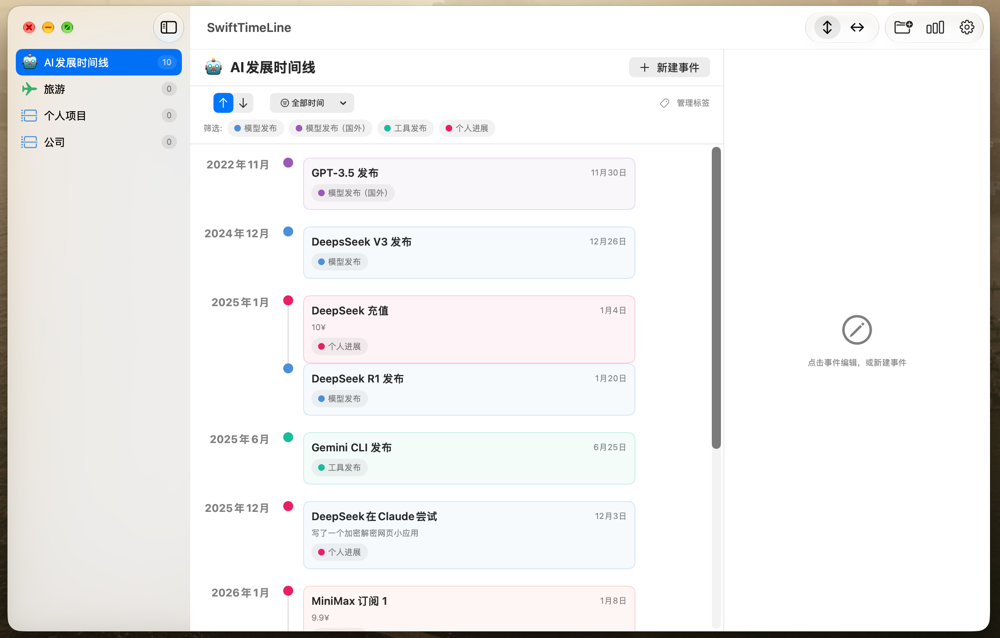

> Vibe coded with DeepSeek V4.1 Flash / OpenCode

English · [简体中文](README.zh-CN.md)

<p align="center">
  
</p>

<h1 align="center">SwiftTimeLine</h1>

<p align="center">A native macOS app for building and exploring personal timelines.</p>

<p align="center">
  
  
  
</p>

---

## Screenshot



## Features

- **Timeline groups** — organize events into groups, each with its own color and a customizable icon (any SF Symbol or a custom emoji). Drag to reorder; the order is remembered.
- **Rich events** — title, description, start date, optional end date, location, link, color, tags, and a pin flag.
- **Two timeline layouts**
  - *Vertical* — events grouped by month into cards.
  - *Horizontal* — multi-lane timeline grouped by tag, with hover tooltips, zoom, and fit-to-width.
- **Filtering & sorting** — filter by tags and by date range (all time / last 3 months / last year / this year), and sort ascending or descending. Sort order is remembered per group.
- **Tags** — per-group tags with custom colors, used for lanes and filtering.
- **Statistics** — charts for events per month and events per tag.
- **Export & import**
  - Export a timeline as a PNG image or a vector PDF.
  - Export / import a single group or all data as JSON.
  - Clear all data.
- **Appearance & language** — System / Light / Dark theme, and English / Simplified Chinese UI.
- **Native experience** — standard Settings window (`⌘,`), About window with links, and drag-to-reorder sidebar.

## Requirements

- macOS 15.0 or later
- Xcode 16 or later (Swift 6) — or a Swift 6 toolchain for SPM

## Build & Run

### Xcode

```bash
open SwiftTimeLine.xcodeproj
```

Select the **SwiftTimeLine** scheme and run. This is the recommended way — it produces a full `.app` with the app icon and bundle identifier.

### Swift Package Manager

```bash
swift run
```

The SPM build shares the same sources. It intentionally ignores the asset catalog (app icon) and has no bundle identifier, so prefer the Xcode build for a distributable app.

## Data & Storage

Your data is stored as JSON at:

```
~/Library/Application Support/SwiftTimeLine/data.json
```

You can reveal it from **Settings → Data → Show in Finder**, or export/back it up at any time.

## Localization

The interface ships in **English** and **Simplified Chinese**. Change the language in **Settings → General**, or set it to follow the system.

## Project Structure

```
SwiftTimeLine/
├─ Package.swift              # Swift Package Manager manifest
├─ SwiftTimeLine.xcodeproj    # Xcode project
├─ SwiftTimeLine/
│  ├─ SwiftTimeLineApp.swift  # Xcode app entry point
│  ├─ Models/                 # Data models, store, settings
│  ├─ Views/                  # SwiftUI views
│  ├─ Utils/                  # Localization, formatting, export
│  └─ Assets.xcassets         # App icon
├─ SPM/                       # SPM app entry point
├─ docs/                      # Screenshots and images
└─ LICENSE                    # MIT license
```

## License

Released under the [MIT License](LICENSE).

## Links

- GitHub: <https://github.com/WHYBBE/SwiftTimeLine>
