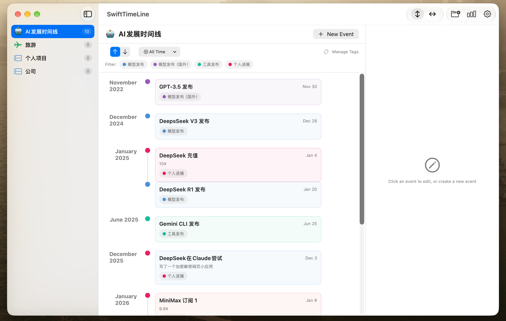

> Vibe Coding而成（DeepSeek V4.1 Flash/OpenCode）

[English](README.md) · 简体中文

<p align="center">
  
</p>

<h1 align="center">SwiftTimeLine</h1>

<p align="center">一款用于构建和浏览个人时间线的原生 macOS 应用。</p>

<p align="center">
  
  
  
</p>

---

## 截图



## 功能

- **时间线分组** —— 将事件按分组管理，每个分组可自定义颜色和图标（任意 SF Symbol 或自定义 emoji）。支持拖拽排序并记住顺序。
- **丰富的事件** —— 标题、描述、开始日期、可选结束日期、地点、链接、颜色、标签以及置顶标记。
- **两种时间线布局**
  - *垂直* —— 按月份分组的卡片式视图。
  - *水平* —— 按标签分泳道的时间线，支持悬浮提示、缩放和适配宽度。
- **筛选与排序** —— 按标签和日期范围（全部 / 近三个月 / 近一年 / 今年）筛选，并支持正序或倒序。排序方式按分组独立记忆。
- **标签** —— 分组内标签，可自定义颜色，用于泳道和筛选。
- **统计** —— 每月事件数与各标签事件数的图表。
- **导出与导入**
  - 将时间线导出为 PNG 图片或矢量 PDF。
  - 以 JSON 导出 / 导入单个分组或全部数据。
  - 清空全部数据。
- **外观与语言** —— 跟随系统 / 浅色 / 深色主题，以及英文 / 简体中文界面。
- **原生体验** —— 标准设置窗口（`⌘,`）、带链接的关于窗口，以及可拖拽排序的侧边栏。

## 环境要求

- macOS 15.0 及以上
- Xcode 16 及以上（Swift 6），或用于 SPM 的 Swift 6 工具链

## 构建与运行

### Xcode

```bash
open SwiftTimeLine.xcodeproj
```

选择 **SwiftTimeLine** scheme 后运行。推荐使用这种方式——会生成包含应用图标和 Bundle Identifier 的完整 `.app`。

### Swift Package Manager

```bash
swift run
```

SPM 构建复用同一份源码，但会有意忽略资源目录（应用图标）且没有 Bundle Identifier，因此若需分发应用，建议使用 Xcode 构建。

## 数据与存储

数据以 JSON 形式存储于：

```
~/Library/Application Support/SwiftTimeLine/data.json
```

可在 **设置 → 数据 → 在访达中显示** 中定位，或随时导出备份。

## 本地化

界面提供 **英文** 和 **简体中文**。可在 **设置 → 通用** 中切换语言，或设为跟随系统。

## 项目结构

```
SwiftTimeLine/
├─ Package.swift              # Swift Package Manager 清单
├─ SwiftTimeLine.xcodeproj    # Xcode 工程
├─ SwiftTimeLine/
│  ├─ SwiftTimeLineApp.swift  # Xcode 应用入口
│  ├─ Models/                 # 数据模型、存储、设置
│  ├─ Views/                  # SwiftUI 视图
│  ├─ Utils/                  # 本地化、格式化、导出
│  └─ Assets.xcassets         # 应用图标
├─ SPM/                       # SPM 应用入口
├─ docs/                      # 截图与图片
└─ LICENSE                    # MIT 许可证
```

## 许可证

基于 [MIT License](LICENSE) 发布。

## 链接

- GitHub: <https://github.com/WHYBBE/SwiftTimeLine>
